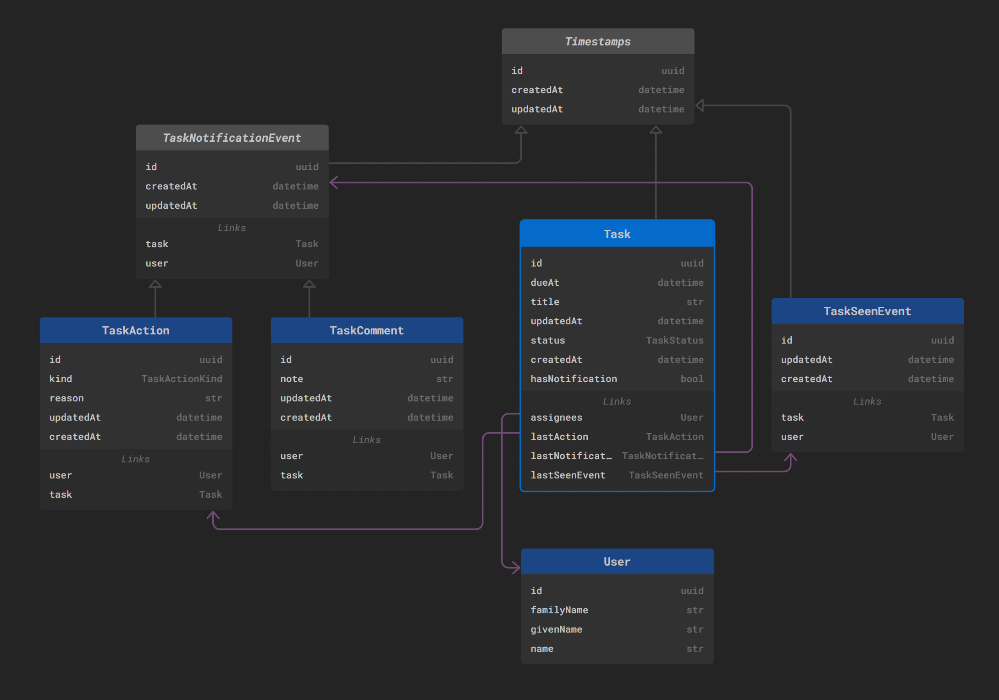

# edgedb-vs-knex

This project contains two Typescript implementations of a task system. The reference implementation is in 'traditional' [knex](knex)/[objection](objection) ORM. The second implementation is in a modern graph-relational EdgeDB using its awesome query builder.

The goal of this project is to practicaly test out the EdgeDB and compare it side-by-side with a traditional ORM setup.

## Schema

- gray box - abstract class
- blue box - concrete entities
- gray arrow - inheritance
- pink arrow - relation

### Description

At the center of our model is a **Task** which holds a `title`, `dueDate` and `assignees`. Each task can be `Opened`, `Closed` or `Edited` multiple times. The state of the task is tracked by the **TaskAction**. From the combination of the `dueDate` and the _last action_ we will compute a `status`.

Next, there is **TaskComment** related to a user & a task.
Together with **TaskAction**, they extend the **TaskNotificationEvent**, meaning that when an action or comment is added to the task, the `assignees` will have see a 'notification flag' when quering the task.

Finally, to 'clear the notification' user will add a **TaskSeenEvent** which will 'shadow' the **TaskNotificationEvent** -- when the _last seen event_ is the most recent than all the notification events, the task will not have a notification.

## Queries

Based on the description, we've implemented three queries:

| Query                   | Kind                              | EdgeDB                                                                     | Knex                                                           |
| ----------------------- | --------------------------------- | -------------------------------------------------------------------------- | -------------------------------------------------------------- |
| Task status             | Computed property (user agnostic) | [taskStatus](./edgedb/src/queries/taskStatusQuery.ts)                      | [taskStatus](./knex/src/queries/taskStatus.ts)                 |
| Task hasNotification    | Computed property (user specific) | [hasNotificationQuery](./edgedb/src/queries/hasNotificationQuery.ts)       | [hasNotification](./knex/src/queries/hasNotification.ts)       |
| Task countNotifications | Aggregation (user specific)       | [countNotificationsQuery](./edgedb/src/queries/countNotificationsQuery.ts) | [countNotifications](./knex/src/queries/countNotifications.ts) |
